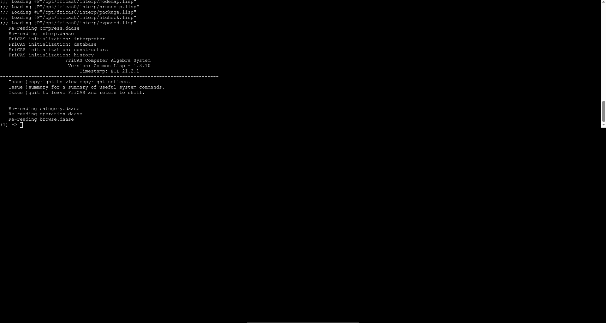

FriCAS in Browser

Try it here: https://wangyenshu.github.io/FriCAS-in-Browser/

Screenshot on chrome:

How to build:

- clone this project
- remove previous ext2.part* files
- run bash.sh

Issue:

- not working on firefox

Credit:
- FriCAS: https://fricas.github.io/
- Embeddable Common-Lisp: https://ecl.common-lisp.dev/
- FriCAS0 -- a pure Common Lisp build: https://github.com/oldk1331/fricas0
- Cheerpx: https://cheerpx.io/docs/getting-started
- Cheerpx License: https://cheerpx.io/licensing
- https://github.com/gzuidhof/coi-serviceworker
